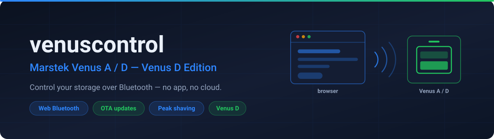
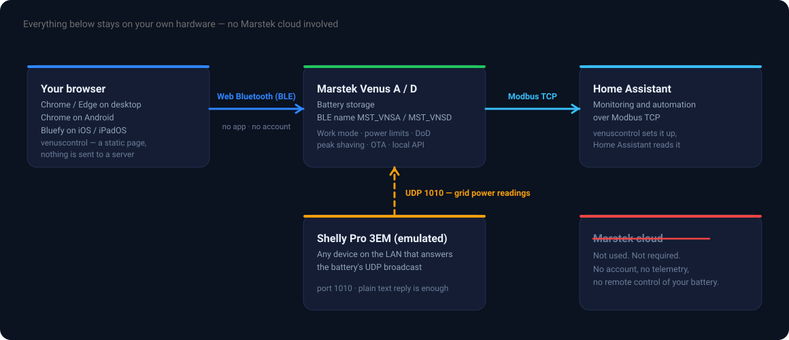
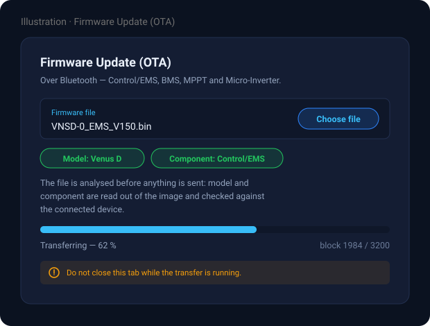

<div align="center">



# venuscontrol — Venus D Edition

**Marstek-Venus-Speicher direkt aus dem Browser einrichten und steuern, über Bluetooth. Ohne App, ohne Konto, ohne Cloud.**

[](#browser-unterstützung)
[](#unterstützte-geräte)
[](LICENSE)
[](#was-lokal-bleibt)

[English](README.md) · **Deutsch**

### 👉 Direkt benutzen, ohne Installation: **https://sphings-dev.de/marstek/control/**

</div>

---

## Worum es geht

Ein Marstek-Venus-Speicher erwartet normalerweise, dass man für jede Änderung über die
Marstek-App und die Marstek-Cloud geht. **venuscontrol** streicht diesen Umweg: Es ist eine
einzelne statische Webseite, die **direkt über Bluetooth Low Energy** mit dem Speicher spricht —
über die [Web-Bluetooth-API](https://developer.mozilla.org/docs/Web/API/Web_Bluetooth_API) des
Browsers.

Seite öffnen, verbinden, Speicher auswählen — und man redet mit dem Gerät. Nichts wird
installiert, es gibt kein Konto, und es werden keine Daten irgendwohin geschickt: Die Seite besteht
aus statischen Dateien, und jeder Befehl geht direkt vom Browser an die Batterie.

Dies ist ein **Fork und die Weiterentwicklung von
[Hypfer/venuscontrol](https://github.com/Hypfer/venuscontrol)**, das auf die Venus A zielt. Das
Verdienst am ursprünglichen Werkzeug und an der Reverse-Engineering-Grundlage liegt vollständig bei
Hypfer. Dieser Fork ergänzt **Unterstützung für die Marstek Venus D**, **OTA-Firmware-Updates** und
eine Reihe zusätzlicher Steuerungen.

---

## Wie das zusammenspielt

<div align="center">

</div>

Das Interessante an dem Bild ist, was **nicht** darin vorkommt. Für einen cloudfreien Betrieb
braucht es drei Dinge, und keines davon ist ein Marstek-Dienst:

1. **Eine Möglichkeit, den Speicher zu konfigurieren** — das ist venuscontrol, über Bluetooth.
2. **Eine Quelle für die Netzleistung** — die Batterie möchte einen Shelly Pro 3EM. Sie gibt sich
   mit allem zufrieden, was im LAN auf ihren UDP-Broadcast antwortet (siehe
   [der Shelly-Trick](#der-shelly-trick)).
3. **Eine Möglichkeit, sie zu überwachen** — Modbus TCP in Home Assistant oder irgendetwas
   anderes, das Modbus spricht.

---

## Was dieser Fork ergänzt

- ✅ **Unterstützung der Marstek Venus D** — an echter Hardware getestet
- 🔄 **OTA-Firmware-Updates über Bluetooth** — Control/EMS, BMS, MPPT und Micro-Inverter
  (VNS- und BMS-Updates von Nutzern bestätigt)
- ⚡ **Geräteleistungsklasse** wählbar (800 / 2200 / 2500 W)
- 📉 **Peak Shaving** — Netzbezug auf einen einstellbaren Schwellwert begrenzen
- 🎚️ **Offset für den Eigenverbrauch** — den Regler auf eine andere Netzleistung als 0 W ziehen
- 🔌 **Local-API-Schalter** — die geräteeigene UDP-JSON-RPC-API aktivieren
- 🕐 **Uhrzeit setzen**
- 🐛 Zuverlässigkeitskorrekturen — korrekte BLE-Befehls-IDs und robustes Zusammensetzen
  fragmentierter BLE-Antworten, damit Geräteinfo und Work Mode verlässlich laden

### Firmware-Updates über Bluetooth

<div align="center">

</div>

> Das ist eine Illustration des Panels, kein Foto einer laufenden Instanz.

Das Firmware-Abbild wird geprüft, **bevor** irgendetwas gesendet wird: Modell und Zielkomponente
werden aus der Datei gelesen und mit dem verbundenen Gerät abgeglichen. Eine Datei für das falsche
Modell — oder ein MPPT-Abbild, das gerade als Control/EMS-Firmware verschickt werden soll — wird
gemeldet statt geflasht.

> ⚠️ **Firmware-Updates sind riskant.** Ein abgebrochenes oder falsches Update kann ein Modul
> unbrauchbar machen. Den Browser-Tab offen lassen und das Gerät während der Übertragung in der
> Nähe behalten.

---

## Die App

<div align="center">

</div>

---

## Unterstützte Geräte

| Gerät | BLE-Name | Status |
|---|---|---|
| Marstek Venus A | `MST_VNSA_xxxx` | Unterstützt (aus dem Upstream-Projekt) |
| Marstek Venus D | `MST_VNSD_xxxx` | Unterstützt — der Schwerpunkt dieses Forks |

Andere Venus-Modelle landen in einer generischen Geräteansicht: Sie zeigt, was sich auslesen lässt,
bietet aber keine modellspezifischen Steuerungen.

---

## Browser-Unterstützung

Web Bluetooth ist eine Browser-Funktion, und nicht jeder Browser bringt sie mit.

| Plattform | Womit |
|---|---|
| **Desktop** (Windows, macOS, Linux) | Chrome oder Edge |
| **Android** | Chrome |
| **iOS / iPadOS** | **[Bluefy – Web BLE Browser](https://apps.apple.com/us/app/bluefy-web-ble-browser/id1492822055)** (kostenlos) |

Safari und Chrome unter iOS unterstützen Web Bluetooth **nicht** — das ist eine Einschränkung von
iOS selbst, nicht dieses Werkzeugs. Bluefy bringt eine eigene Engine mit und funktioniert. Darin
einfach **https://sphings-dev.de/marstek/control/** öffnen.

---

## Was es kann

Alles, was man braucht, um einen Speicher cloudfrei mit einem (emulierten) Shelly Pro 3EM zu
betreiben, plus Überwachung über Modbus TCP:

- **Status** — Ladezustand, verbleibende Energie, Batterie-, Netz- und AC-Leistung, Notstromlast,
  PV-Eingänge sowie die Energiehistorie für heute, diesen Monat und insgesamt
- **Work Mode** — inklusive Zeitplänen mit Start-/Endzeit und Lade-/Entladeleistung
- **Leistungsgrenzen** und **Geräteleistungsklasse** (800 / 2200 / 2500 W)
- **Entladetiefe (DoD)**
- **Peak Shaving** mit einstellbarem Schwellwert
- **Offset für den Eigenverbrauch**
- **CT-/Zähler-Einstellungen**
- **Local-API**-Schalter (UDP-JSON-RPC auf dem Gerät)
- **Uhrzeit setzen**, **Geräteinfo**, **Zustand der Batteriemodule**, **Werksreset**
- **OTA-Firmware-Updates**

Cloud-Funktionen wie Arbitrage über dynamische Börsenpreise sind bewusst **nicht** Teil davon —
dafür braucht es den Herstellerdienst, und genau den soll dieses Werkzeug überflüssig machen.

---

## Der Shelly-Trick

Man braucht weder uni-meter noch etwas Vergleichbares. Alles, was die Batterie von einem Shelly
Pro 3EM will, ist irgendetwas auf der Broadcast-Adresse des Subnetzes, das auf **UDP-Port 1010**
lauscht und ihre Anfragen beantwortet.

Man muss das Shelly-Protokoll nicht einmal richtig sprechen. Beim Testen stellte sich heraus, dass
der JSON-Parser der Firmware gar kein JSON-Parser ist, sondern eher „String-Offset suchen, 2 Bytes
später Integer lesen“. Deshalb funktioniert diese Antwort:

```
a_act_power==${l1},b_act_power==${l2},c_act_power==${l3},total_act_power==${total}
```

Man könnte ihr auch Prosa schicken:

```
Dearest Marstek,

I hope this UDP packet finds you well.
Today, the a_act_poweris${pA}watts.

However, the b_act_poweris${pB}watts, which is interesting.
And look at c_act_poweris${pC}watts!

In conclusion, the total_act_poweris${total}watts.

Sincerely,
The Shelly Emulator.
```

Man sollte es vermutlich nicht tun — möglich wäre es.

---

## Was lokal bleibt

- Die Seite ist **statisch** — HTML, CSS und JavaScript, kein Backend, keine API-Aufrufe irgendwohin.
- Der Bluetooth-Verkehr läuft **direkt vom Browser zur Batterie**. Er geht durch keinen Server.
- Kein Konto, kein Login, keine Telemetrie, kein Tracking.
- Selbst hosten heißt schlicht: die gebauten Dateien auf einem beliebigen Webserver ausliefern. Die
  Kopie auf sphings-dev.de ist reine Bequemlichkeit.

Web Bluetooth verlangt einen sicheren Kontext, die Seite muss also über **HTTPS** (oder von
`localhost`) ausgeliefert werden — das ist eine Browser-Regel, keine Entscheidung dieses Projekts.

---

## Selbst betreiben

```bash
npm install
npm run dev      # Entwicklungsserver
npm run build    # statische Dateien in dist/
```

Der Inhalt von `dist/` ist die komplette Anwendung. Er gehört auf einen beliebigen statischen
Webhost mit HTTPS.

---

## Häufige Fragen

**Muss ich auf die Marstek-App verzichten?**
Nein. venuscontrol ändert Einstellungen am Gerät, die App funktioniert weiter. Der Punkt ist, dass
man App und Cloud für die hier abgedeckten Einstellungen nicht mehr *braucht*.

**Muss die Batterie dafür online sein?**
Nein — im Gegenteil. Bluetooth ist eine direkte Funkverbindung zwischen Handy oder Notebook und der
Batterie. Es funktioniert auch mit komplett deaktiviertem WLAN der Batterie.

**Warum Bluetooth und nicht die lokale API?**
Die geräteeigene API muss erst eingeschaltet werden, und das geht nur über Bluetooth oder über die
Cloud-App. venuscontrol hat einen Schalter dafür.

**Kann ich mir mit der OTA-Funktion die Batterie zerschießen?**
Ein fehlgeschlagenes Firmware-Update kann ein Modul in einen schlechten Zustand bringen, wie bei
jedem Firmware-Update. Das Werkzeug prüft das Abbild vorher gegen das verbundene Gerät, das Risiko
trägt aber man selbst. Nur Abbilder flashen, denen man traut — und eine laufende Übertragung nicht
unterbrechen.

**Wird die Venus E unterstützt?**
Nicht gezielt. Venus E v1/v2 läuft auf einer anderen Firmware-Basis und landet daher in der
generischen Geräteansicht.

---

## Verwandte Projekte

- 🌐 **Weitere Projekte und Tools:** [sphings-dev.de](https://sphings-dev.de/)
- 📦 **Firmware-Archiv für Marstek-Venus-Geräte:** [sphings79/marstek-firmware-archiv](https://github.com/sphings79/marstek-firmware-archiv)
- 🛡️ **Firmware-Backup / Checker:** [marstek-fw-checker](https://sphings-dev.de/marstek/marstek-fw-checker/) — eine Kopie eines Firmware-Abbilds ziehen und zum Archiv beitragen. Hinweis: Eine Firmware lässt sich nur sichern, solange sie noch aussteht, also **bevor sie installiert wurde** — nach dem Flashen kommt man nicht mehr heran.
- 🔬 **Reverse Engineering der Venus-D-Firmware:** [sphings79/Marstek-Venus-D-Firmware-Reverse-Engineering](https://github.com/sphings79/Marstek-Venus-D-Firmware-Reverse-Engineering)
- 🏠 **Home-Assistant-Integration über Modbus:** [sphings79/marstek_venus_modbus_dev](https://github.com/sphings79/marstek_venus_modbus_dev)

## Dank

- Ursprüngliches Werkzeug: **[Hypfer/venuscontrol](https://github.com/Hypfer/venuscontrol)**
- Firmware-Archiv und Reverse-Engineering-Referenzen: [rweijnen/marstek-firmware-archive](https://github.com/rweijnen/marstek-firmware-archive) · [rweijnen/marstek-venus-monitor](https://github.com/rweijnen/marstek-venus-monitor)

## ⭐ Nützlich gefunden?

Wenn das geholfen hat, den Speicher aus der Cloud zu holen, freue ich mich ehrlich über einen
**Stern** für das Repository — das hilft anderen Venus-Besitzern, es zu finden. Danke!

## Lizenz

Apache License 2.0 — siehe [LICENSE](LICENSE).
